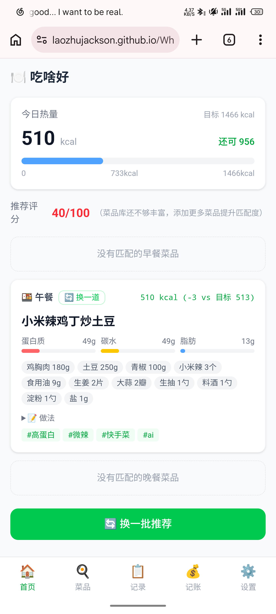
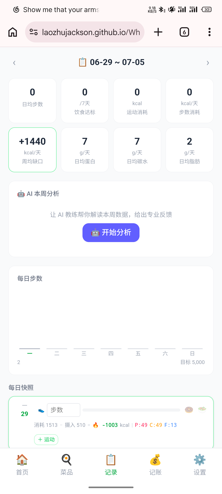
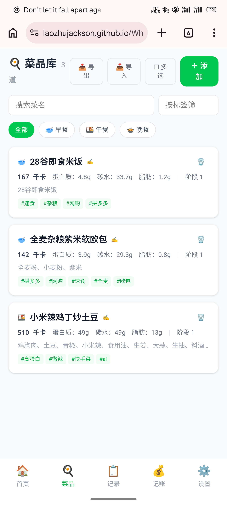
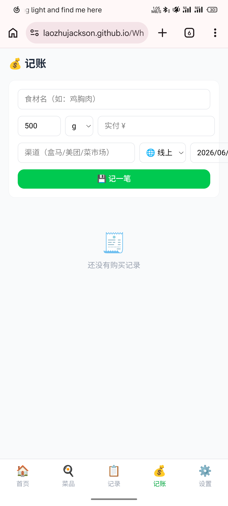

# 🍽️ 吃啥好 · WhatTheWok

如果你想要减脂，同时想要自己做饭，但是不知道具体吃什么，吃多少，想要有个地方记录下菜谱，食材，做法，该菜包含的营养，那这个网页就是为你而生的。

**线上地址**: [laozhujackson.github.io/WhatTheWok](https://laozhujackson.github.io/WhatTheWok/)

---

## 功能

| 模块 | 说明 |
|------|------|
| 🏠 **首页** | AI 每日三餐推荐，换一道微调，自动同步热量+宏量到记录 |
| 🍳 **菜品库** | 搜索/标签筛选/批量操作，JSON 导入导出（PC↔手机） |
| 📋 **记录** | 周步数柱状图、运动记录（19种MET估算）、每日热量缺口、宏量追踪 |
| 🤖 **AI 教练** | 一键分析本周数据，4维度专业反馈（热量/蛋白/运动/体重） |
| 💰 **记账** | 食材购买记录，月度支出统计 |
| ⚙️ **设置** | 身体档案、DeepSeek API Key、微信推送 |

### 编辑器亮点
- 🤖 **AI 生成菜品**：单道/批量，队列式审核保存，生成后自动用本地食材库校准营养
- 📊 **AI 估算营养**：填食材+克重 → 本地库精确匹配 + AI 兜底补算
- 🔍 **食材实时搜索**：输入时下拉候选（1457 种中国食物成分表第6版），选中自动填名+单位
- 🍚 **包装食品换算器**：商品每100g数值 → 实际吃的量

### 记录页亮点
- 🔥 **热量缺口**：BMR + 步数 + 运动 − 摄入，日均缺口 + P/C/F 宏量一目了然
- 🤖 **AI 教练分析**：4 维度周报（热量缺口/蛋白质/运动/体重趋势），分项评分+具体建议
- 💥 **火焰特效**：步数超过目标150%时柱子火星粒子动画

## 页面截图

| 首页 | 记录 |
|------|------|
|  |  |

| 菜品库 | 记账 |
|------|------|
|  |  |

---

## 技术栈

React 19 · TypeScript 6 · Vite 8 · Tailwind CSS v4 · Dexie.js 4 · DeepSeek API v4

纯前端，数据存浏览器 IndexedDB，无需服务器。GitHub Pages 部署。

---

## 开发

```bash
cd health-hub
npm install
npm run dev       # http://localhost:5173
npm run deploy    # tsc + vite build + push gh-pages
```

---

## 数据同步

PC 导出 JSON → 复制 → 微信发送 → 手机粘贴导入。免找文件路径。

---

## 许可

[MIT](LICENSE)
